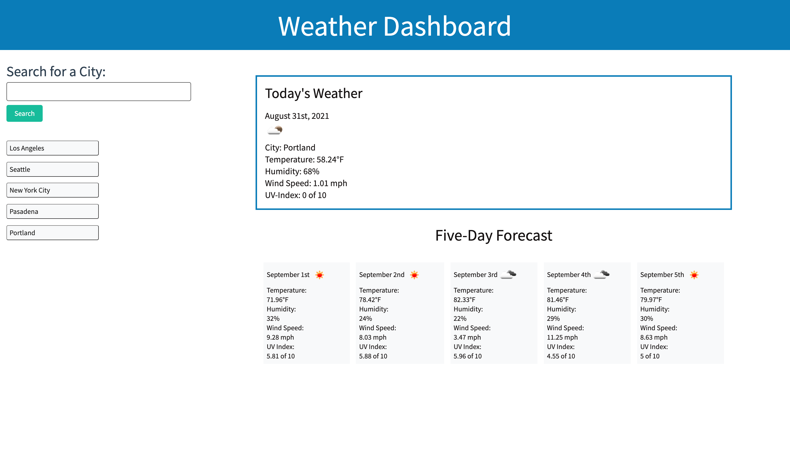

# weather-dashboard

## Description
This application, Weather Dashboard, was created with the purpose of allowing the user to search for a city in the United States and see its current weather (including temperature, humidity, wind speed, and UV index) as well as the weather for the next five days. Once the user has searched for a city, it is saved in local storage as well as below the search bar so the user knows what cities they've searched for. The user can also click on a previously-searched city to quickly load its current and five-day forecast again. 

## Installation
For installation and deployment, please [click here](https://candiceywu.github.io/weather-dashboard/). The user can then type in a city into the search bar and the application will display the corresponding weather.

## Languages and technologies used
This application utilized HTML, CSS, JavaScript, jQuery, Bootstrap and Moment.JS.

## Usage
The user can easily search for a city to find out the current weather and five-day forecast for that city. The application also saves previous cities that the user searched for, so they can click on the saved city without re-entering text in the search bar to pull up weather information. The following image shows the web application's appearance:

## License & copyright

(c) Candice Wu 

Licensed under the MIT License.